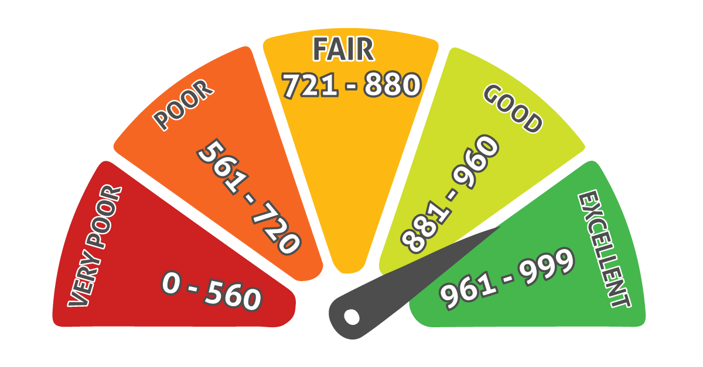

# **Proyecto de Credit Scoring**

## **1. Introducción**

Tras el estallido de la crisis financiera de 2008, la debilidad en las entidades financieras ha permanecido latente en estos últimos tiempos. Restricciones al crédito y problemas de liquidez han sido algunas de las consecuencias causadas por una mala gestión de riesgos por parte de estas entidades. Estas consecuencias las seguimos sufriendo a día de hoy; por ello, los sistemas que faciliten un uso eficiente de la gestión de riesgos o representen mecanismos de mayor control serán necesarios para que estas situaciones no se vuelvan a repetir.

Los acuerdos de Basilea II, publicados en 2004, ya recomendaron la necesidad de mejorar la calidad de los créditos con la medición de la probabilidad de incumplimiento(*probability of default*). Una de estas herramientas para este propósito es el *credit escoring*, que se puede definir como un sistema de modelos e decision que permite a una entidad financiera calcular la probabilidad de que un cliente no devuelva un crédito. De esta manera la entidad podrá saber en cada caso qué riesgo esta asumiendo al conceder ese crédito y podrá valorar hasta dónde estará dispuesta a llegar.

## **2. La Teoría del credit Scoring**

### **2.1. Definición y objetivos**

El *credit scoring* es un sistema de modelos de decisión a través del cual se calcula la probabilidad de que un sujeto sea capaz de devolver o no un crédito comercial. Este sistema se basa en el uso de modelos estadísticos a través de los cuales se transformaran los datos previamente obtenidos del solicitante en medidas numéricas que servirán de apoyo en la toma dedecisiones. De esta manera, la entidad emisora del crédito podrá decidir si conceder o, en caso contrario, determinar que el sujeto no cumple los requisitos necesarios.

En la actualidad la gran mayoria de las entidades financieras utilizan estos sistemas de *credit scoring* tanto por su rapidez como por su fiabilidad. También presenta determinadas desventajas, como la gran dependencia que estos sitemas tienen de los datos.

Para que el sistema de *credit scoring* pueda realizar una correcta valoración del prestatario será necesario el analisis de las caracteristicas del mismo y tambien de las caracteristicas del credito solicitado.El solicitante del crédito podrá ser una persona fisica o una persona jurídica, siendo diferente el análisis de datos en este segundo caso.

### **2.2. Variables y datos**

En primer lugar, los datos que recogerá la entidad serán de caracte más general, de esta manera se podrá realizar una primera valoración del sujeto. Estos datos dependerán del tipo de solicitante.

* *Trabajadores por cuenta ajena.* Documentación requerida:
    - Declaración de bienes de personas físicas
    - I.R.P.F
    - Nóminas
    - Titulos de propiedad
    - Capitulaciones matrimoniales en caso de separación de bienes
    - Tres últimos recibos del pago de deudas bancarias, en caso de que existiesen
* *Pymer y autónomos.* Documentación requerida:
    - Justificantes de los tres últimos pagos a la Seguridad Social
    - I.R.P.F; IVA
    - Títulos de propiedad
    - Contratos y documentos que acrediten otros ingresos y fincabilidad
    - Tres últimos recibos del pago de deudas bancarias, en caso de que existiesen

* *Personas jurídicas.* Documentación requerida:
    - Justificantes de los tres últimos pagos a la Seguridad Social
    - Títulos de propiedad
    - Contratos y documentos varios
    - Tres últimos recibos del pago de deudas bancarias, en caso de que existiesen
    - Impuesto de sociedades, IVA útimo año, IVA trimestrales

